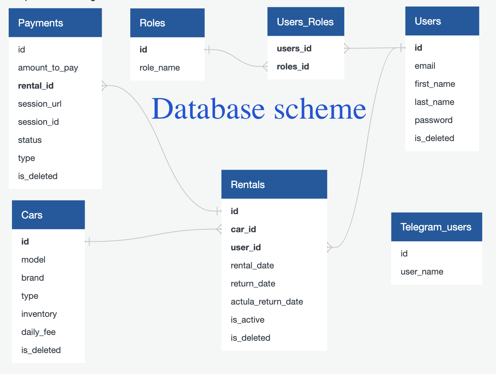

# Car Rental Service

## Introduction

In today's world, where convenience and efficiency are paramount, traditional car rental services often lag behind in terms of technology and user experience. Imagine a scenario where you need to rent a car quickly, but the process involves cumbersome paperwork, manual record-keeping, and limited payment options. This is the problem that inspired the creation of the Car Rental Service project.

</img>

There is a car sharing service in your city, where you can rent cars and pay for your usage using cash, depending on the duration of your rental. However, the existing system for tracking cars, rentals, users, and payments is outdated and inefficient. Everything is managed manually, leading to errors, confusion, and frustration for both users and administrators. With no way to check the availability of specific cars, limited payment methods, and no tracking of rental returns, the need for a modern, online management system is evident.

## Technologies and Tools Used

* **Spring Boot Starter WEB:** for building robust and scalable Java applications

* **Spring Security:** for implementing authentication and authorization

* **Spring Data JPA:** for data access and persistence

* **Swagger:** for API documentation

* **Liquibase:** for database schema management

* **Docker and docker-compose:** for containerization and deployment

* **JWT Token Authentication:** for secure user authentication

* **GitHub:** for version control and collaboration

* **Stripe:** for handling payment processing

* **Telegram API:** for integrating Telegram bots

## Functionalities

**The Car Rental Service project offers the following functionalities:**

* **Automated Car Rental:** Users can rent cars online, streamlining the rental process and eliminating the need for manual paperwork.

* **Management of Cars:** Administrators can manage the inventory of cars, track availability, and update car information as needed.

* **Secure Authentication:** Utilizes JWT token authentication for secure user authentication and authorization.

* **Payment Processing:** Integrates with Stripe for handling payment processing, providing users with secure and convenient payment options.

* **Telegram Notifications:** Implements Telegram bots for sending notifications to users and administrators, enhancing communication and providing real-time updates.

## Setup and Usage

1. Clone the repository from GitHub.

2. Ensure you have Docker installed and running.

3. Set up your environment variables in the `.env` file, including Stripe secret keys and Telegram bot tokens.

|Database Configuration|Description|
|:---|:---|
|`spring.datasource.url=`|JDBC URL for your database|
|`spring.datasource.username=`|Username for your database|
|`spring.datasource.password=`|Password for your database|
|`spring.datasource.driver-class-name=`|Driver class name for your database|
|`spring.jpa.hibernate.ddl-auto=`|Strategy for schema generation||
|`spring.jpa.show-sql=`|Enable logging of SQL statements|
|`spring.jpa.open-in-view=`|Register OpenEntityManagerInViewInterceptor. Exposes entity manager to the view layer|
|`spring.jpa.properties.hibernate.dialect=`|Dialect to use with Hibernate|
|**JWT Configuration**||
|`jwt.expiration=`|Expiration time of JWT token in milliseconds|
|`jwt.secret=`|Secret key for JWT token|
|**Stripe Configuration**||
|`stripe.secret.key=`|Secret key provided by Stripe for API authentication|
|**URLs Configuration**||
|`success.path=` |Path for success endpoint in payment service|
|`cancel.path=`|Path for cancel endpoint in payment service|
|**Telegram Bot Configuration**||
|`scheme.protocol=`|Protocol for the Telegram bot URL (e.g., https)|
|`host=`|Hostname for the Telegram bot URL|
|`bot.name=` |Name of your Telegram bot|
|`bot.token=`|Token for your Telegram bot|
|**Scheduled Task Configuration**||
|`cron.time=`|Cron expression for the scheduled task|

5. Run docker-compose up to start the application and associated services.

6. Access the API documentation using Swagger at `{base_url}/swagger-ui.html`.

7. Explore the available endpoints and functionalities.

8. Utilize the provided Postman collection for testing and development: <a href="https://galactic-meadow-347245.postman.co/workspace/New-Team-Workspace~095e9df6-4048-4837-86a9-4a9827b0e200/collection/33241432-8be47c0d-d4e4-4151-b96d-e5b2b689cbdf?action=share&creator=33241432"> Postman Collection</a>

9. I also add the database scheme for a better understanding of working with it.
   </img>

## Challenges Faced

* **Integration with External APIs:** Integrating with external APIs such as Stripe and the Telegram API required thorough understanding and careful implementation to ensure seamless communication and functionality.

* **Security Concerns:** Implementing secure authentication and payment processing posed challenges in terms of ensuring data privacy and protection against potential vulnerabilities. Through rigorous testing and adherence to best practices, we addressed these concerns effectively.

## Conclusion

The Car Rental Service project revolutionizes the traditional car rental experience by providing a modern, online management system that enhances convenience, efficiency, and security for both users and administrators. By leveraging cutting-edge technologies and robust design principles, we aim to streamline the car rental process and deliver an exceptional user experience. We welcome feedback and contributions to further improve and expand the capabilities of our platform.

